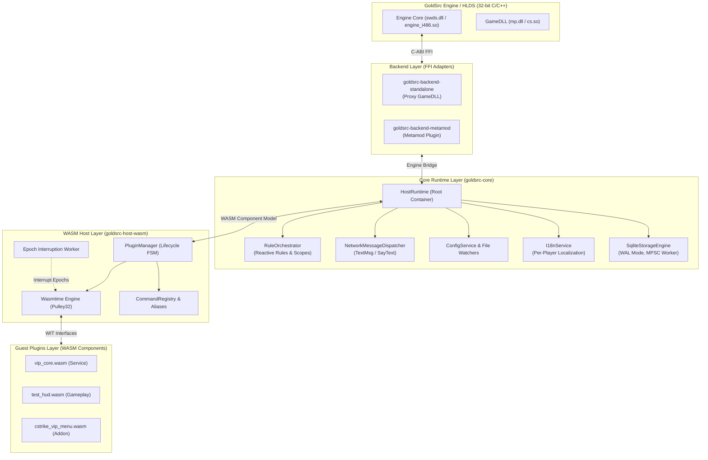
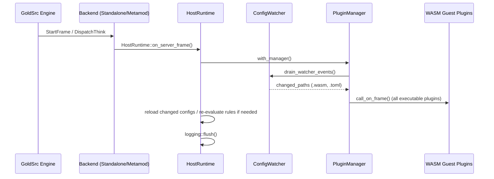
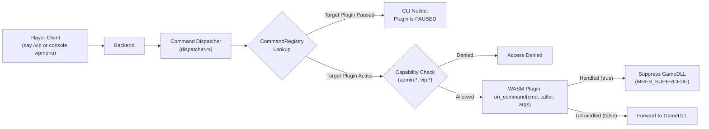
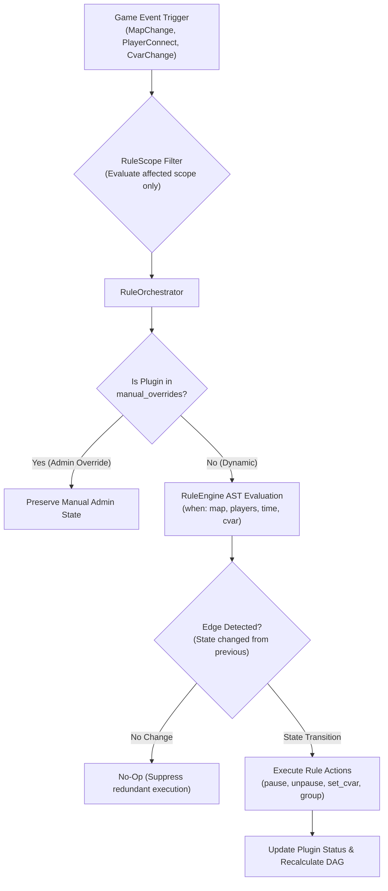

# GoldSrc.rs Architecture Guide

Welcome to the architectural specification for **GoldSrc.rs** — a modern, modular, memory-safe plugin framework and WebAssembly runtime for GoldSrc engine servers (Half-Life, Counter-Strike 1.6, and compatible mods).

---

## 1. System Overview

GoldSrc.rs bridges the legacy GoldSrc C/C++ engine environment (HLDS, ReHLDS) with modern Rust systems engineering and isolated WebAssembly (WASM) guest plugins.



---

## 2. Workspace & Crate Structure

The repository is organized into distinct functional layers:

```text
goldsrc-rs/
├── core/
│   ├── goldsrc-api/                # Safe guest/host shared domain types, traits, DAG, ECS, and builders
│   ├── goldsrc-core/               # Host runtime, config, i18n, storage, logging, rule engine, FFI bridge
│   └── goldsrc-sys/                # Low-level raw FFI bindings to GoldSrc/Metamod headers (unsafe)
├── backends/
│   ├── goldsrc-backend-metamod/    # Metamod C-ABI adapter (meta_api.h)
│   └── goldsrc-backend-standalone/ # Proxy GameDLL adapter (GetEntityAPI2 / liblist.gam)
├── hosts/
│   └── goldsrc-host-wasm/          # Wasmtime runtime, Component Model bindings, epoch timer, plugin manager
├── framework/
│   ├── goldsrc/                    # Lightweight developer SDK for WASM guest plugins
│   └── goldsrc-macros/             # Procedural macros (#[plugin], #[command], #[event], #[system])
├── references/                     # C/C++ reference headers (HLSDK, Metamod, ReHLDS, ReGameDLL)
├── resources/                      # Configuration templates, default localization files, gamedata
├── scripts/                        # Modular Python toolchain (build, deploy, verify, analyze, setup)
└── examples/demo_plugins/          # Reference demo plugins (test_suite, vip_core, admin_system)
```

---

## 3. System Taxonomy & Role Suffixes

To maintain architectural purity and prevent God Objects, GoldSrc.rs strictly enforces standard role suffixes across all crates and components:

| Suffix | Responsibility | Architectural Invariants | Current / Target Examples |
| :--- | :--- | :--- | :--- |
| **`Engine`** | Low-level computational engine, execution driver, or external runtime platform. | Operates on raw bytecode, low-level OS/C-ABI, AST parsing, or DB connections. Agnostic of high-level gameplay rules. | `wasmtime::Engine`, `goldsrc_api::Engine` (C-ABI bridge), `SqliteStorageEngine`, `RuleEngine` (AST evaluator). |
| **`Orchestrator`** | High-level workflow coordinator managing lifecycle, phase DAGs, and multi-system synchronization. | Does not execute low-level operations directly. Coordinates the execution order across multiple independent subsystems. | `RuleOrchestrator` (game triggers $\to$ AST evaluation $\to$ plugin/cvar toggles), `PluginOrchestrator` (discovery $\to$ Phased DAG $\to$ load order). |
| **`Manager`** | State machine and lifecycle owner for a pool of homogeneous domain entities. | Owns collections (`Vec`, `HashMap`), executes state transitions (`Running`, `Paused`, `Unloaded`, `Blocked`), and performs CRUD. | `PluginManager` (owns `Vec<LoadedPlugin>` and Wasmtime stores), `MenuManager` (owns player menu sessions). |
| **`Registry`** | Passive or semi-passive catalog for lookups and symbol resolution. | Key-value or alias indexing. Does not own lifecycle or execute domain business logic. | `CommandRegistry` (command name/alias $\to$ owners), `PlaceholderRegistry` (tag $\to$ handler), `RuleRegistry` (predicate name $\to$ evaluator). |
| **`Service`** | Self-contained domain capability provider. | Encapsulates specific domain logic behind a clean API. May maintain internal caches or worker threads. Pluggable implementations implement service traits. | `ConfigService` (TOML watching & reload events), `I18nService` (translation by player locale), `AuthService` (player capabilities). |
| **`Dispatcher`** | Message/event router delivering payloads between producers and consumers. | Decouples senders from receivers. Routes 1-to-1 or 1-to-many. Does not hold persistent business state. | `EventDispatcher` (dispatches events to WASM plugins), `NetworkMessageDispatcher` (packs GoldSrc `TextMsg`/`SayText` network frames), `HookDispatcher`. |
| **`Router`** | Input argument parser and direct endpoint dispatcher. | Parses incoming raw command lines, text tokens, or network inputs and routes to matching handlers. | `CliRouter` (`dispatch_host_command`), `CommandRouter` (chat `/cmd` and console dispatch). |
| **`Bridge`** | Technical adapter across foreign runtime or ABI boundaries. | Connects two fundamentally different environments (e.g. C/C++ FFI, WIT component interfaces, or OS-level bindings). | `ReApiBridge` (ReHLDS/ReGameDLL FFI), `MetamodBridge`, `EngineBridge`. |

---

## 4. Key Runtime Data Flows

### 4.1. Server Frame Ticking (`on_server_frame`)



### 4.2. Command & Chat Ingestion Flow



### 4.3. Reactive Rule Orchestration Flow



---

## 5. Architectural Principles

1. **Zero Hardcoded Environment Paths**:
   All filesystem interactions must resolve paths dynamically through `PathResolver` relative to game directory (`cstrike/`, `valve/`) or localized `.goldsrc.local.toml`.
2. **Panic Boundary & Sandbox Isolation**:
   - Host Rust panics must never cross the C-ABI boundary (all entry points guarded with `catch_ffi_panic`).
   - WASM guest panics are isolated via `catch_unwind` and epoch interruption (preventing infinite loops from hanging HLDS). A crashed plugin becomes `Poisoned` without destabilizing the server process.
3. **Deterministic Dependency Ordering (`PhasedDag`)**:
   Plugin execution order, ECS systems, and event listeners strictly resolve via Kahn's topological sort with phased stratification (`Core` $\to$ `Service` $\to$ `Gameplay` $\to$ `Addon` $\to$ `Analytics`). Magic priority integers are forbidden.
4. **Game-Agnostic Core**:
   `goldsrc-core` and `goldsrc-api` contain zero game-specific assumptions (no CS 1.6 specific weapons, teams, or buyzone rules). Mod-specific features reside in dedicated extension crates (e.g. `goldsrc-game-cstrike`).
5. **Defensive Resource Management & Narrow Lock Scopes**:
   Re-entrant mutex calls are actively guarded (`HostRuntime::with_manager`). Long operations (rule evaluation, file reading) drop locks before execution.

---

## 6. State-Guarded Engine Boundary Architecture

GoldSrc.rs enforces a mathematically coherent, type-safe boundary over the unsafe, mutable C-ABI memory of the GoldSrc/ReHLDS engine (`edict_t*`, `entvars_t*`). This architecture eliminates whole classes of server-crashing bugs (null pointer dereferences, accessing disconnected players, and order-dependent hook conflicts) via zero-cost compiler proofs.

```mermaid
graph TD
    subgraph StateSpace ["1. State Space & Dimensions"]
        Target["Domain Entity / Player Handle\n(Entity, Player)"]
        Properties["Value Objects: Property&lt;Target&gt;\n(Health, Armor, Origin, Velocity)"]
        Target -->|queries / mutates via CQS| Properties
    end

    subgraph Verification ["2. Compile-Time Invariants & Specifications"]
        Markers["ZST Typestate Markers\n(Alive, Dead, Connected, InBuyZone)"]
        Specs["Specifications: Spec&lt;Target&gt;\n(All&lt;(Alive, Connected)&gt;, Any&lt;...&gt;)"]
        Refined["Witness Token: Refined&lt;'a, Target, S&gt;\n(Frame-scoped lifetime 'a)"]

        Markers --> Specs
        Properties -->|inspected by| Specs
        Specs -->|proven via try_new()| Refined
        Target -->|borrowed by| Refined
    end

    subgraph ControlFlow ["3. Control Flow & Interceptor Pipeline"]
        Pipeline["Interceptor Pipeline (Chain of Responsibility)\n(Validation -> Cooldown -> Audit -> Execution)"]
        Actions["Actions & State Transitions\n(DamageAction, BuyWeaponAction, Teleport)"]
        Engine["Engine C-ABI Boundary\n(g_engfuncs.pfnSetOrigin, TakeDamage)"]

        Pipeline -->|intercepts / authorizes / modifies| Actions
        Refined -->|passed as required witness| Actions
        Actions -->|applies final mutation via PropSet| Engine
    end

    style StateSpace fill:#1e293b,stroke:#3b82f6,stroke-width:2px,color:#fff
    style Verification fill:#0f172a,stroke:#10b981,stroke-width:2px,color:#fff
    style ControlFlow fill:#18181b,stroke:#f59e0b,stroke-width:2px,color:#fff
```

### 6.1. The Four Pillars

1. **Rich Value Objects over Naked Primitives**:
   Measurements (`Health`, `Armor`, `Origin`, `Velocity`) are self-validating newtypes. Passing an `Armor` value into a `Health` parameter is rejected at compile time.
2. **Symmetrical Command-Query Separation (CQS)**:
   - `PropGet<Target>`: Pure, non-mutating reading of engine properties.
   - `PropSet<Target>`: Explicit mutation that safely orchestrates engine side effects (e.g. updating BSP collision nodes on `Origin` mutation).
   - `Property<Target>`: Blanket trait for symmetric read-write properties (`PropGet + PropSet`).
3. **Compile-Time Specifications & Zero-Sized Typestate (ZST)**:
   - State phases (`Alive`, `Dead`, `Connected`, `InBuyZone`) are Zero-Sized Types (`size_of::<T>() == 0`), incurring zero runtime memory overhead.
   - Compound invariants use tuple-based variadic specifications: `All<(Alive, Connected, InBuyZone)>`.
   - Functions requiring preconditions accept a `Refined<'a, Target, Spec>`, guaranteeing that runtime checks occur once at the handler boundary and are completely elided inside leaf functions.
4. **Universal Interceptor Pipeline (Chain of Responsibility)**:
   A composable `Pipeline<Ctx>` with `Interceptor<Ctx>` middleware wraps engine hooks, action dispatches, and property mutations. Interceptors can inspect, modify (e.g. via `CommutativeModifier`), bypass (`Handled`), or completely suppress (`Block` / `MRES_SUPERCEDE`) execution.

### 6.2. Engine Invariant Defense Rules

- **Frame-Scoped Lifetimes (`'a`)**:
  `Refined<'a, Target, S>` guards must never be stored across frame ticks. Entities in GoldSrc can be recycled or disconnected by engine callbacks at any microsecond; long-term references must store stable `EntityIndex` or serial handles and re-validate via `refine::<Spec>()` on subsequent ticks.
- **Re-entrancy Safety**:
  Calling an `Action` that invokes native C-ABI functions (e.g. `TakeDamage`) can synchronously trigger recursive engine hooks before the initial call returns. Interceptors and actions must release internal mutexes/locks prior to crossing the FFI boundary.
- **Entity Generation / Serial Number Tracking**:
  Entity slot indices ($1..32$ for players, $33..N$ for entities) are recycled by GoldSrc upon deletion. All `Spec` verifications must check generation serial counters to prevent operations against resurrected entity handles.

