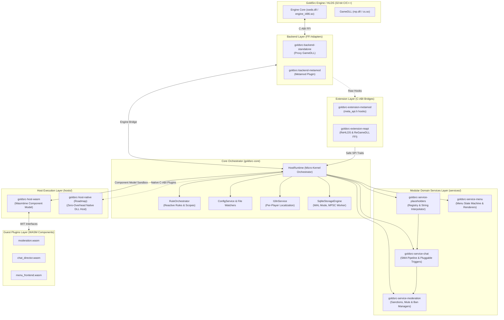
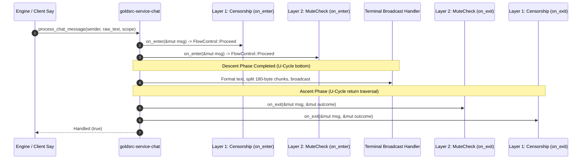
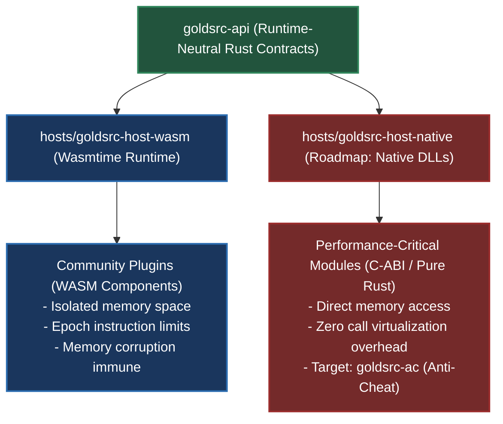
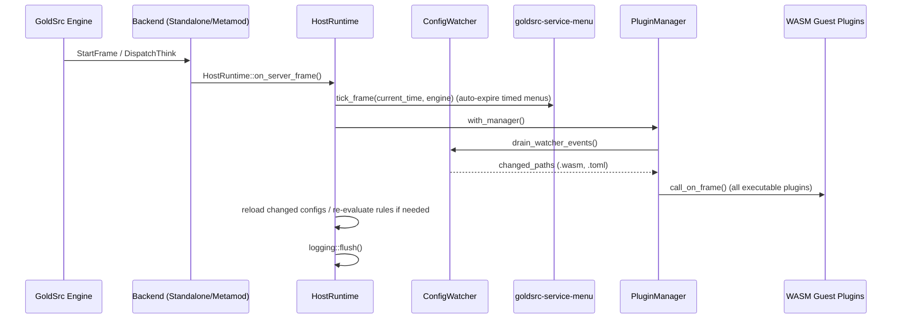
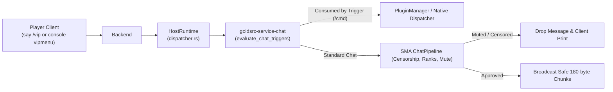

# GoldSrc.rs Architecture Guide

Welcome to the architectural specification for **GoldSrc.rs** — a modern, modular, memory-safe plugin framework and WebAssembly runtime for GoldSrc engine servers (Half-Life, Counter-Strike 1.6, and compatible mods).

---

## 1. System Overview

GoldSrc.rs bridges the legacy GoldSrc C/C++ engine environment (HLDS, ReHLDS) with modern Rust systems engineering, high-performance modular domain services, and isolated WebAssembly (WASM) guest plugins.


```mermaid
flowchart TB
    subgraph GoldSrcEngine ["GoldSrc Engine / HLDS (32-bit C/C++)"]
        EngineCore["Engine Core (swds.dll / engine_i486.so)"]
        GameDLL["GameDLL (mp.dll / cs.so)"]
    end

    subgraph Backends ["Backend Layer (FFI Adapters)"]
        Standalone["goldsrc-backend-standalone\n(Proxy GameDLL)"]
        Metamod["goldsrc-backend-metamod\n(Metamod Plugin)"]
    end

    subgraph Extensions ["Extension Layer (C-ABI Bridges)"]
        ExtMetamod["goldsrc-extension-metamod\n(meta_api.h hooks)"]
        ExtReApi["goldsrc-extension-reapi\n(ReHLDS & ReGameDLL FFI)"]
    end

    subgraph Core ["Core Orchestrator (goldsrc-core)"]
        HostRuntime["HostRuntime (Micro-Kernel Orchestrator)"]
        RuleOrch["RuleOrchestrator\n(Reactive Rules & Scopes)"]
        ConfigSvc["ConfigService & File Watchers"]
        I18nSvc["I18nService\n(Per-Player Localization)"]
        StorageEngine["SqliteStorageEngine\n(WAL Mode, MPSC Worker)"]
    end

    subgraph Services ["Modular Domain Services Layer (services/)"]
        SvcPlaceholders["goldsrc-service-placeholders\n(Registry & String Interpolator)"]
        SvcMenu["goldsrc-service-menu\n(Menu State Machine & Renderers)"]
        SvcChat["goldsrc-service-chat\n(SMA Pipeline & Pluggable Triggers)"]
        SvcModeration["goldsrc-service-moderation\n(Sanctions, Mute & Ban Managers)"]
    end

    subgraph Hosts ["Host Execution Layer (hosts/)"]
        HostWasm["goldsrc-host-wasm\n(Wasmtime Component Model)"]
        HostNative["goldsrc-host-native (Roadmap)\n(Zero-Overhead Native DLL Host)"]
    end

    subgraph GuestPlugins ["Guest Plugins Layer (WASM Components)"]
        PluginA["moderation.wasm"]
        PluginB["chat_director.wasm"]
        PluginC["menu_frontend.wasm"]
    end

    EngineCore <-->|C-ABI FFI| Backends
    Backends <-->|Engine Bridge| HostRuntime
    Backends -.->|Raw Hooks| Extensions
    Extensions -->|Safe SPI Traits| HostRuntime

    HostRuntime --> RuleOrch
    HostRuntime --> ConfigSvc
    HostRuntime --> I18nSvc
    HostRuntime --> StorageEngine

    HostRuntime --> SvcPlaceholders
    HostRuntime --> SvcMenu
    HostRuntime --> SvcChat
    HostRuntime --> SvcModeration

    SvcPlaceholders --> SvcChat
    SvcChat --> SvcModeration

    HostRuntime <-->|Component Model Sandbox| HostWasm
    HostRuntime -.->|Native C-ABI Plugins| HostNative
    HostWasm <-->|WIT Interfaces| GuestPlugins
```

---

## 2. Workspace & Crate Structure

The `goldsrc-runtime` repository houses the host engine, C-ABI backends, modular domain services, and execution hosts:

```text
goldsrc-runtime/
├── backends/                                   # Engine ingestion & FFI lifecycle adapters
│   ├── goldsrc-backend-metamod/                # Metamod C-ABI plugin adapter (meta_api.h)
│   └── goldsrc-backend-standalone/             # Standalone proxy GameDLL adapter (GetEntityAPI2)
├── core/
│   └── goldsrc-core/                           # Pure Micro-Kernel Orchestrator (HostRuntime, Storage, I18n, Rules)
├── extensions/                                 # Low-level C/C++ ABI bridges to external engine/mod APIs
│   ├── goldsrc-extension-metamod/              # Safe Rust abstraction over Metamod callbacks
│   └── goldsrc-extension-reapi/                # Safe Rust bridge to ReHLDS and ReGameDLL C-ABIs
├── hosts/                                      # Plugin execution runtimes
│   └── goldsrc-host-wasm/                      # Wasmtime runtime, Component Model sandbox, Epoch timer
├── services/                                   # Pure Rust high-level domain subsystems
│   ├── goldsrc-service-placeholders/           # Universal placeholder registry & token interpolator
│   ├── goldsrc-service-menu/                   # Interactive player menus, pagination, cooldowns, DHUD
│   ├── goldsrc-service-chat/                   # SMA chat pipeline (stitch-rs), triggers, and target routing
│   └── goldsrc-service-moderation/             # Native server sanctions (kick, mute, ban), MuteChatLayer
├── resources/                                  # Default configuration templates and language dictionaries
└── scripts/                                    # Toolchain & deployment automation scripts
```

### External Ecosystem Repositories

GoldSrc.rs enforces strict repository separation to eliminate monolithic build bloat and prevent circular dependencies:

- **[`goldsrc-sdk`](https://github.com/goldsrc-rs/goldsrc-sdk)**: Pure guest SDK (`goldsrc-api`, procedural macros `goldsrc-macros`, SPI definitions `goldsrc-spi`, and raw FFI bindings `goldsrc-sys`). Contains zero runtime host dependencies.
- **[`goldsrc-plugins-standard`](https://github.com/goldsrc-rs/goldsrc-plugins-standard)**: Standard canonical WASM plugins suite (`administration`, `chat_director`, `map_manager`, `menu_frontend`, `moderation`, `privileges`).
- **[`goldsrc`](https://github.com/goldsrc-rs/goldsrc)**: Facade crate, developer CLI (`grs`), and architectural standards hub.
- **[`goldsrc-template-plugin-rust`](https://github.com/goldsrc-rs/goldsrc-template-plugin-rust)**: Template repository for scaffolding new WASM plugins via `cargo generate`.

---

## 3. Strict Architectural Taxonomy: Extensions vs Services

A critical architectural invariant in GoldSrc.rs is the strict separation between **Extensions** (`extensions/`) and **Services** (`services/`):

| Dimension | **Extensions (`extensions/`)** | **Services (`services/`)** |
| :--- | :--- | :--- |
| **Architectural Scope** | **Low-level C/C++ ABI Adapter** | **Pure Rust Domain Subsystem** |
| **Primary Responsibility** | Bridge foreign, unsafe engine and mod interfaces (Metamod, ReHLDS, ReGameDLL) into safe Rust traits. | Implement platform business and gameplay capabilities (chat pipelines, menus, moderation, placeholders). |
| **Memory & Safety Boundary** | Crosses foreign C-ABI memory. Uses `unsafe` with audited `// SAFETY:` blocks, pointer checks, and panic barriers. | 100% Safe Rust. Never touches raw engine pointers directly. |
| **Dependencies** | `goldsrc-spi`, `goldsrc-api`, foreign C headers (ReHLDS/Metamod). | `goldsrc-api`, `goldsrc-spi`, `stitch-rs`. **Zero C-ABI dependencies.** |
| **Portability & Reuse** | Bound to specific native engine binaries (x86 Linux ELF / Windows DLL). | Fully portable: runs identically in WASM guests, Native Host, standalone CLI tools, or headless unit test suites. |
| **Examples** | `goldsrc-extension-reapi`, `goldsrc-extension-metamod`. | `goldsrc-service-placeholders`, `goldsrc-service-menu`, `goldsrc-service-chat`, `goldsrc-service-moderation`. |

> [!IMPORTANT]
> **Boundary Rule:**  
> A `Service` must **never** directly depend on an `Extension` or import foreign C headers. All interaction between Services and the engine occurs via runtime-neutral `goldsrc-api` handles or `goldsrc-spi` engine bridge traits.

---

## 4. The Sewing Machine Architecture (SMA / `stitch-rs`) in Services

High-throughput systems (such as `goldsrc-service-chat`) adopt the **Sewing Machine Architecture (SMA)** pioneered by [stitch-rs](https://github.com/ulquiorracode/stitch-rs) to achieve zero allocations and microsecond execution on hot paths:


```mermaid
sequenceDiagram
    autonumber
    participant Engine as Engine / Client Say
    participant SvcChat as goldsrc-service-chat
    participant Layer1 as Layer 1: Censorship (on_enter)
    participant Layer2 as Layer 2: MuteCheck (on_enter)
    participant Core as Terminal Broadcast Handler
    participant Layer2Exit as Layer 2: MuteCheck (on_exit)
    participant Layer1Exit as Layer 1: Censorship (on_exit)

    Engine->>SvcChat: process_chat_message(sender, raw_text, scope)
    SvcChat->>Layer1: on_enter(&mut msg) -> FlowControl::Proceed
    SvcChat->>Layer2: on_enter(&mut msg) -> FlowControl::Proceed
    Note over SvcChat,Core: Descent Phase Completed (U-Cycle bottom)
    SvcChat->>Core: Format text, split 180-byte chunks, broadcast
    Note over SvcChat,Layer1Exit: Ascent Phase (U-Cycle return traversal)
    SvcChat->>Layer2Exit: on_exit(&mut msg, &mut outcome)
    SvcChat->>Layer1Exit: on_exit(&mut msg, &mut outcome)
    SvcChat-->>Engine: Handled (true)
```

### SMA Core Principles

1. **Strictly Bounded U-Cycle Traversal**:
   Middleware layers execute in two explicit phases: descent (`on_enter`) and ascent (`on_exit`). Ascent only executes for layers that successfully descended.
2. **Zero-Allocation Short-Circuiting**:
   Flow control is governed by `FlowControl<P, S, H>`:
   - `FlowControl::Proceed(())`: Continue descent to subsequent layers.
   - `FlowControl::ShortCircuit(())`: Skip remaining descent layers, jump straight to terminal handler and ascent.
   - `FlowControl::Halt(())`: Immediately abort execution (e.g. muted player or censored text), skipping the terminal handler.
3. **Decoupled Triggers vs Commands**:
   Chat messages containing commands (`/vip`, `!menu`, `rtv`) are intercepted by pluggable `ChatTrigger` handlers before entering the chat formatting pipeline, preventing command strings from leaking into public player chat.

---

## 5. Execution Hosts: WASM Sandbox vs Future Native Host

GoldSrc.rs supports a multi-host architecture to balance absolute safety against maximum raw performance:


```mermaid
graph TD
    classDef wasm fill:#1a365d,stroke:#2b6cb0,stroke-width:2px,color:#fff;
    classDef native fill:#742a2a,stroke:#9b2c2c,stroke-width:2px,color:#fff;
    classDef api fill:#22543d,stroke:#2f855a,stroke-width:2px,color:#fff;

    API["goldsrc-api (Runtime-Neutral Rust Contracts)"]:::api

    HostWasm["hosts/goldsrc-host-wasm (Wasmtime Runtime)"]:::wasm
    HostNative["hosts/goldsrc-host-native (Roadmap: Native DLLs)"]:::native

    WasmPlugins["Community Plugins (WASM Components)\n- Isolated memory space\n- Epoch instruction limits\n- Memory corruption immune"]:::wasm
    NativeModules["Performance-Critical Modules (C-ABI / Pure Rust)\n- Direct memory access\n- Zero call virtualization overhead\n- Target: goldsrc-ac (Anti-Cheat)"]:::native

    API --> HostWasm
    API --> HostNative

    HostWasm --> WasmPlugins
    HostNative --> NativeModules
```

### Why `goldsrc-api` is Runtime-Agnostic

1. **Decoupling `.wit` from Guest SDK**:
   The WebAssembly Component Model specification (`.wit`) is a transport and binding artifact for `goldsrc-host-wasm`, not an intrinsic requirement of the GoldSrc domain.
2. **Path for Native Host (`goldsrc-ac`)**:
   Modules like anti-cheats (`goldsrc-ac`) require direct process memory scanning, high-frequency tick hooks, and raw instruction inspection. Virtualizing these operations through WASM creates unacceptable latency. By keeping `goldsrc-api` pure Rust, the same API traits can execute either sandboxed in WASM or natively in high-performance DLL modules.

---

## 6. System Taxonomy & Role Suffixes

To maintain architectural purity and prevent God Objects, GoldSrc.rs strictly enforces standard role suffixes across all crates and components:

| Suffix | Responsibility | Architectural Invariants | Current / Target Examples |
| :--- | :--- | :--- | :--- |
| **`Engine`** | Low-level computational engine, execution driver, or external runtime platform. | Operates on raw bytecode, low-level OS/C-ABI, AST parsing, or DB connections. Agnostic of high-level gameplay rules. | `wasmtime::Engine`, `goldsrc_api::Engine` (C-ABI bridge), `SqliteStorageEngine`, `RuleEngine` (AST evaluator). |
| **`Orchestrator`** | High-level workflow coordinator managing lifecycle, phase DAGs, and multi-system synchronization. | Does not execute low-level operations directly. Coordinates the execution order across multiple independent subsystems. | `RuleOrchestrator` (game triggers $\to$ AST evaluation $\to$ plugin/cvar toggles), `HostRuntime` (micro-kernel host coordinator). |
| **`Manager`** | State machine and lifecycle owner for a pool of homogeneous domain entities. | Owns collections (`Vec`, `HashMap`), executes state transitions (`Running`, `Paused`, `Unloaded`, `Blocked`), and performs CRUD. | `PluginManager` (owns `Vec<LoadedPlugin>` and Wasmtime stores), `MenuSessionManager` (owns player menu sessions), `BanRegistry`. |
| **`Registry`** | Passive or semi-passive catalog for lookups and symbol resolution. | Key-value or alias indexing. Does not own lifecycle or execute domain business logic. | `CommandRegistry` (command name/alias $\to$ owners), `PlaceholderRegistry` (tag $\to$ handler), `RuleRegistry` (predicate name $\to$ evaluator). |
| **`Service`** | Self-contained domain capability provider. | Encapsulates specific domain logic behind a clean API. May maintain internal caches or worker threads. Pluggable implementations implement service traits. | `ConfigService` (TOML watching & reload events), `I18nService` (translation by player locale), `AuthService` (player capabilities). |
| **`Dispatcher`** | Message/event router delivering payloads between producers and consumers. | Decouples senders from receivers. Routes 1-to-1 or 1-to-many. Does not hold persistent business state. | `EventDispatcher` (dispatches events to WASM plugins), `NetworkMessageDispatcher` (packs GoldSrc `TextMsg`/`SayText` network frames). |
| **`Router`** | Input argument parser and direct endpoint dispatcher. | Parses incoming raw command lines, text tokens, or network inputs and routes to matching handlers. | `CliRouter` (`dispatch_host_command`), `CommandRouter` (chat `/cmd` and console dispatch). |
| **`Bridge`** | Technical adapter across foreign runtime or ABI boundaries. | Connects two fundamentally different environments (e.g. C/C++ FFI, WIT component interfaces, or OS-level bindings). | `ReApiBridge` (ReHLDS/ReGameDLL FFI), `MetamodBridge`, `EngineBridge`. |

### 6.1 Entity Identity & Handle Taxonomy

To guarantee impenetrable engine thread-safety, zero-cost abstractions, and eliminate Slot Recycling Hazards (e.g. background tasks resolving recycled slots), GoldSrc.rs strictly categorizes entity and client identifiers:

| Concept / Suffix | Concurrency & Threading | Lifetime & Invariants | Resolution & Purpose | Examples |
| :--- | :--- | :--- | :--- | :--- |
| **`Handle`** | Strictly Main Thread (`!Send`, `!Sync`, `PhantomData<*const ()>`) | Frame-local, direct engine binding. Read/write validates `serialnumber` against host `edict_t`. | Direct CQS operations (`get`, `set`, `act`, `modify`). Never stored across long async intervals. | `Player`, `Client`, `Entity`, `EDict` |
| **`Slot`** / **`Id`** | Thread-Safe POD (`Copy`, `Clone`, `Send`, `Sync`) | Ephemeral slot index (`1..=32` or `0..=MAX_EDICTS`). Does not track entity lifecycles across disconnects. | Fast lightweight referencing, frame parameters, array indexing. Resolves via `.resolve() -> Option<Handle>`. | `PlayerSlot`, `EntityId` |
| **`Token`** / **`Session`** | Thread-Safe Generational (`Copy`, `Clone`, `Send`, `Sync`) | Long-lived identity bound to a specific generation (`user_id`, `serial`, `map_generation`). Immune to slot recycling (Alice $\to$ Bob). | Multi-thread workers (`goldsrc::task::spawn`), delayed callbacks. Implements `GenerationalToken` with `is_valid(&self) -> bool`. | `PlayerSession`, `EntityToken` |

---

## 7. Key Runtime Data Flows

### 7.1. Server Frame Ticking (`on_server_frame`)


```mermaid
sequenceDiagram
    participant Engine as GoldSrc Engine
    participant Backend as Backend (Standalone/Metamod)
    participant Host as HostRuntime
    participant Watcher as ConfigWatcher
    participant MenuSvc as goldsrc-service-menu
    participant PluginMgr as PluginManager
    participant Guest as WASM Guest Plugins

    Engine->>Backend: StartFrame / DispatchThink
    Backend->>Host: HostRuntime::on_server_frame()
    Host->>MenuSvc: tick_frame(current_time, engine) (auto-expire timed menus)
    Host->>PluginMgr: with_manager()
    PluginMgr->>Watcher: drain_watcher_events()
    Watcher-->>PluginMgr: changed_paths (.wasm, .toml)
    PluginMgr->>Guest: call_on_frame() (all executable plugins)
    Host->>Host: reload changed configs / re-evaluate rules if needed
    Host->>Host: logging::flush()
```

### 7.2. Command & Chat Ingestion Flow


```mermaid
flowchart LR
    PlayerClient["Player Client\n(say /vip or console vipmenu)"] --> Backend
    Backend --> Host["HostRuntime\n(dispatcher.rs)"]
    Host --> ChatSvc["goldsrc-service-chat\n(evaluate_chat_triggers)"]
    ChatSvc -- "Consumed by Trigger (/cmd)" --> DispatchCmd["PluginManager / Native Dispatcher"]
    ChatSvc -- "Standard Chat" --> SMAPipeline["SMA ChatPipeline (Censorship, Ranks, Mute)"]
    SMAPipeline -- "Muted / Censored" --> Suppress["Drop Message & Client Print"]
    SMAPipeline -- "Approved" --> Broadcast["Broadcast Safe 180-byte Chunks"]
```

---

## 8. Architectural Principles

1. **Zero Hardcoded Environment Paths**:
   All filesystem interactions must resolve paths dynamically through `PathResolver` relative to game directory (`cstrike/`, `valve/`) or localized `.goldsrc.local.toml`.
2. **Panic Boundary & Sandbox Isolation**:
   - Host Rust panics must never cross the C-ABI boundary (all entry points guarded with `catch_ffi_panic`).
   - WASM guest panics are isolated via `catch_unwind` and epoch interruption (preventing infinite loops from hanging HLDS). A crashed plugin becomes `Poisoned` without destabilizing the server process.
3. **Deterministic Dependency Ordering (`PhasedDag`)**:
   Plugin execution order, ECS systems, and event listeners strictly resolve via Kahn's topological sort with phased stratification (`Core` $\to$ `Service` $\to$ `Gameplay` $\to$ `Addon` $\to$ `Analytics`). Magic priority integers are forbidden.
4. **Game-Agnostic Core**:
   `goldsrc-core` and `goldsrc-api` contain zero game-specific assumptions (no CS 1.6 specific weapons, teams, or buyzone rules). Mod-specific features reside in dedicated extension crates (e.g. `goldsrc-game-cstrike`).
5. **Defensive Resource Management & Narrow Lock Scopes**:
   Re-entrant mutex calls are actively guarded (`HostRuntime::with_manager`). Long operations (rule evaluation, file reading) drop locks before execution.
6. **The Scrooge Systems Mindset (Zero-Waste Mechanical Sympathy)**:
   Every byte and CPU cycle counts. Data layouts align with 64-byte cache lines; allocations on frame-tick hot paths are strictly zero. Speculative complexity without measured Criterion benchmark proof is rejected.
