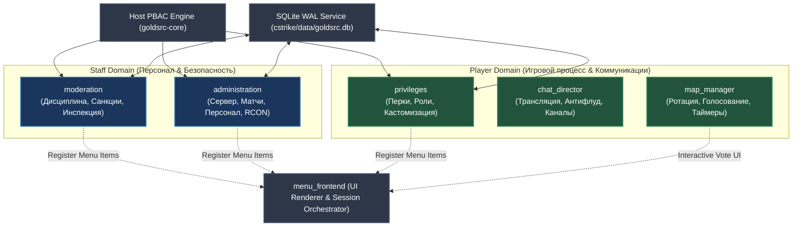

# GoldSrc.rs Standard Plugin Suite: Specification & Architecture

> **Document Status:** Architectural Specification  
> **Target Release:** `v0.18.0` / `v0.20.0` Monorepo Decomposition (`goldsrc-plugins-standard`)  
> **Taxonomy Standard:** Strictly aligned with `ARCHITECTURE.md` (Role Suffixes, Entity Handles, PBAC)

---

## 1. Naming & Taxonomy Rules: "System" vs "Module" vs "Bundle" vs "Plugin"

В кодовой базе GoldSrc.rs действует строгая таксономия терминов:

1. **ECS System (`System`)**: Функция или структура внутри плагина, реализующая один из этапов пайплайна ECS (`Validate` -> `Modify` -> `Execute` -> `React` -> `Monitor`). Не является отдельным бинарником.
2. **WASM Plugin (`Plugin`)**: Независимая единица компиляции (`.wasm`), работающая в песочнице Wasmtime Component Model. Имеет метаданные роли (`Coordinator`, `Service`, `Feature`, `Ui`, `Peer`).
3. **Bundle (`Bundle`)**: Автономный директориальный пакет (`plugins/<bundle_name>/`), объединяющий 1 или несколько связанных плагинов с общей директорией данных `addons/goldsrc/data/<bundle_name>/` и изолированным конфигом `configs/<bundle_name>.toml`.
4. **Standard Plugin Suite**: Официальный набор эталонных плагинов, поставляемых с платформой для полной замены устаревшего стека AMX Mod X.

### Канонический нейминг плагинов (Standard Plugins)

Чтобы исключить путаницу между ECS-системами и самими плагинами:
* На уровне репозитория/папки плагины именуются по их **доменной роли**:
  - `moderation` (ранее `moderation_system`)
  - `administration` (ранее `administration_system`)
  - `privileges` (ранее `vip_core` / `privileges_system`)
  - `menu_frontend`
  - `chat_director`
  - `map_manager`
* В манифестах `plugins.toml` и идентификаторах они фигурируют как:
  - `goldsrc:moderation`
  - `goldsrc:administration`
  - `goldsrc:privileges`
  - `goldsrc:menu-frontend`
  - `goldsrc:chat-director`
  - `goldsrc:map-manager`

---

## 2. Матрица стандартных плагинов (The Core 6 Suite)

---

## 3. Детальная спецификация плагина `moderation`

### Назначение
Оперативное поддержание порядка на сервере, изоляция нарушителей и читеров, пресечение деструктивного поведения. Модератор не имеет технических прав управления сервером (не может сменить карту, отключить плагин или изменить CVAR).

### Доменные сущности (SQLite)
Таблица `moderation_records`:
- `id`: INTEGER PRIMARY KEY AUTOINCREMENT
- `target_auth`: TEXT (SteamID / Hash)
- `target_ip`: TEXT (Subnet / IP)
- `target_name`: TEXT
- `issuer_auth`: TEXT (SteamID модератора или `CONSOLE`)
- `action_type`: TEXT (`ban`, `mute_voice`, `mute_chat`, `gag`)
- `reason`: TEXT
- `created_at`: INTEGER (UNIX Timestamp)
- `expires_at`: INTEGER (UNIX Timestamp, 0 = permanent)
- `active`: BOOLEAN

### Полный спектр дисциплинарных санкций
1. **`kick` (`grs_kick <#userid|name> [reason]`)**:
   - Немедленный разрыв соединения с указанием причины в консоли и диалоговом окне клиента.
   - Capability: `moderation:action:kick`.
2. **`ban` / `tempban` (`grs_ban <#userid|name> <duration_mins> [reason]`)**:
   - Блокировка по двойному идентификатору (SteamID + IP-подсеть).
   - Поддержка разбана: `grs_unban <auth_or_ip>`.
   - Проверка бана в `ClientConnect` через асинхронный кэш SQLite без фризов тикрейта.
   - Capability: `moderation:action:ban`.
3. **`slap` (`grs_slap <#userid|name> [damage=0]`)**:
   - Физический толчок игрока случайным импульсом скорости `Vector3` со звуком удара.
   - Нанесение фиксированного урона (по умолчанию 0 HP, безопасно для вывода AFK из текстур/дверей).
   - Capability: `moderation:action:slap`.
4. **`slay` (`grs_slay <#userid|name>`)**:
   - Мгновенное убийство энтити игрока (`take_damage(Health::MAX)`) со спавном спрайта молнии/взрыва и звуком.
   - Capability: `moderation:action:slay`.
5. **`mute` (Voice Mute) (`grs_mute <#userid|name> [duration_mins] [reason]`)**:
   - Блокировка передачи голосового сетевого трафика через `SetClientListening`.
   - Временный мут с авто-снятием по таймеру `TimerService`.
   - Capability: `moderation:action:mute:voice`.
6. **`gag` (Chat Mute) (`grs_gag <#userid|name> [duration_mins] [reason]`)**:
   - Перехват сетевых сообщений `say` и `say_team`.
   - Блокировка как текстовых сообщений, так и стандартных радиокоманд при злоупотреблении спамом.
   - Capability: `moderation:action:mute:chat`.
7. **`freeze` / `unfreeze` (`grs_freeze <#userid|name> [seconds]`)**:
   - Временная заморозка перемещения (обнуление `maxspeed` и блокировка флагов инпута `IN_FORWARD`, `IN_BACK`, `IN_MOVELEFT`, `IN_MOVERIGHT`, `IN_JUMP`).
   - Применяется при проверке на подозрение в читах перед вызовом на проверку.
   - Capability: `moderation:action:freeze`.
8. **Инспекция (`grs_inspect <#userid|name>`)**:
   - Вывод информации: IP, страна/город (через `grlg-geo`), провайдер, тип подключения (VPN/Hosting/Mobile), FP/loss/choke, время на сервере, активные репорты.
   - Capability: `moderation:inspect`.
9. **Меню модератора (`grs_modmenu`)**:
   - Интерактивное древовидное меню: Выбор действия -> Выбор игрока -> Выбор предзаданного времени -> Выбор причины -> Подтверждение.
   - Полная замена `plmenu.sma`.

---

## 4. Детальная спецификация плагина `administration`

### Назначение
Техническое управление сервером, расписанием, конфигурацией, матчами и учетными записями персонала. Администратор не занимается ежедневным мутом спамеров, его фокус — надежность и регламент сервера.

### Функционал и команды
1. **Управление картами и ротацией (`admin:map`)**:
   - `grs_map <mapname>`: немедленная смена карты с предварительным предупреждением игроков.
   - `grs_restart [seconds=1]`: рестарт раунда (`sv_restart`).
2. **Управление матчем и соревновательным процессом (`admin:match`)**:
   - `grs_pause`: техническая пауза сервера (`pausable 1` + freeze всех игроков).
   - `grs_exec <cfg_name>`: применение конфига (e.g. `clanwar.cfg`, `warmup.cfg`, `pub.cfg`).
3. **Управление персоналом и ролями (`admin:rbac`)**:
   - `grs_staff_add <auth> <role> [expires]`: назначение модератора/администратора.
   - `grs_staff_revoke <auth>`: немедленный отзыв прав.
   - `grs_staff_list`: список активного персонала онлайн и оффлайн.
4. **Управление движком и плагинами (`admin:engine`)**:
   - Выполнение RCON команд, изменение защищенных CVAR (`mp_timelimit`, `mp_roundtime`).
   - Доступ к хост-командам `grs plugins reload`, `grs hardware`.
5. **Аудит лог персонала (`grs_audit [limit=20]`)**:
   - Просмотр журнала последних санкций модераторов для разбора апелляций и жалоб на злоупотребление полномочиями.
6. **Админ-меню (`grs_adminmenu`)**:
   - Интерактивное меню управления сервером: смена карт, конфигурации, матчевые настройки. Полная замена `cmdmenu.sma`.

---

## 5. Детальная спецификация плагина `privileges`

### Назначение
Управление игровыми привилегиями, бонусами, косметическими эффектами и уровнями доступа игроков (VIP, Premium, Clan Member, Streamer). Строго изолирован от модераторских команд.

### Функционал
1. **Экипировка в начале раунда (Equipment Perks)**:
   - Автоматическая или запрашиваемая через меню выдача брони (`item_assaultsuit`), гранат (`hegrenade`, `flashbang`), дефьюз-кита.
   - Ограничение выдачи по раундам (например, только со 2-го раунда, запрет на `weapon_awp` на первых раундах).
2. **Резервные слоты (Slot Reservation)**:
   - Защита слота при переполнении сервера (вытеснение спектатора или игрока с наибольшим пингом).
   - Замена устаревшего `adminslots.sma`.
3. **Косметические кастомизации (Cosmetics)**:
   - Префиксы в табе и чате (`[VIP]`, `[Premium]`).
   - Уникальные скины ножей или моделей игроков без рассинхронизации хитбоксов.
4. **Меню привилегий (`grs_privmenu` / `say /vip`)**:
   - Интерактивное меню настройки персональных перков: выбор оружия, включение/отключение трассеров, авто-закупка.

---

## 6. Детальная спецификация плагина `menu_frontend`

### Назначение
Универсальный фасад и оркестратор внутриигровых меню Half-Life (замена `menufront.sma`).

### Возможности
1. **Динамический реестр пунктов**: Любой плагин (`moderation`, `administration`, `privileges`) регистрирует свой раздел через контракт.
2. **Единая навигация**: Автоматическая разбивка на страницы (1..8 — пункты, 9 — Далее, 0 — Назад/Выход).
3. **Безопасная изоляция сессий**: Хранение состояния меню на сессионных токенах игрока (`PlayerSessionToken`), защита от нажатий после дисконнекта.
4. **Поддержка `messagemode`**: Запрос текстового ввода (причина бана, кастомное количество времени) с прозрачным возвратом в меню.

---

## 7. Детальная спецификация плагина `chat_director`

### Назначение
Управление текстовой и голосовой коммуникацией, защита от спама и автоматическая трансляция сообщений (замена `adminchat.sma`, `antiflood.sma`, `imessage.sma`, `scrollmsg.sma`).

### Возможности
1. **Антифлуд (`AntifloodService`)**: Экспоненциальный лимитер частоты сообщений с предупреждением игрока.
2. **Каналы коммуникации**:
   - `say_team @ <text>`: отправка сообщения напрямую модераторам и администраторам онлайн.
   - `admin_chat`: защищенный закрытый чат для персонала.
3. **Информационные трансляции**:
   - Ротация сообщений в чате, DHUD/HUD бегущие строки с поддержкой плейсхолдеров (`{server:timeleft}`, `{player:name}`).
   - Мультиязычность через `I18nService`.

---

## 8. Детальная спецификация плагина `map_manager`

### Назначение
Автоматизированный контроль времени карты, ротация, номинации и голосование (замена `mapchooser.sma`, `nextmap.sma`, `timeleft.sma`).

### Возможности
1. **Тайм-трекер**: Отслеживание `mp_timelimit` и оставшегося времени раундов.
2. **Команды игроков**: `say timeleft`, `say currentmap`, `say nextmap`, `say /maps`.
3. **Интерактивное голосование**:
   - Старт голосования за 2-3 минуты до конца карты.
   - Защита от частой смены одной и той же карты (история последних $N$ карт).
   - Вывод результатов в реальном времени с процентами через меню.
